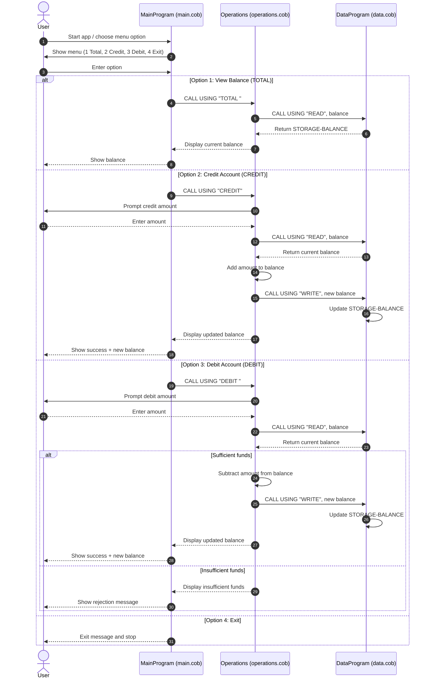

# COBOL Student Account Module Documentation

This document describes the COBOL programs under `src/cobol/` and how they work together to manage a student account balance.

## Overview

The application is split into three programs:

- `main.cob`: User interface and menu loop.
- `operations.cob`: Account operation logic (view, credit, debit).
- `data.cob`: In-memory storage access (read/write balance).

The programs communicate through `CALL ... USING` parameters. `MainProgram` calls `Operations`, and `Operations` calls `DataProgram`.

## File-by-File Purpose and Key Functions

### `src/cobol/main.cob` (`PROGRAM-ID. MainProgram`)

Purpose:

- Provides the interactive menu for account actions.
- Collects user input and dispatches the requested operation.

Key behavior:

- Repeats until the user selects Exit (`4`).
- Menu options:
  - `1`: View balance (`CALL 'Operations' USING 'TOTAL '`).
  - `2`: Credit account (`CALL 'Operations' USING 'CREDIT'`).
  - `3`: Debit account (`CALL 'Operations' USING 'DEBIT '`).
  - `4`: Exit program.
- Invalid choices display an error message and return to the menu.

Notes:

- Operation codes are fixed-width (`PIC X(6)`), so `TOTAL` and `DEBIT` are passed with trailing spaces.

### `src/cobol/operations.cob` (`PROGRAM-ID. Operations`)

Purpose:

- Implements the business logic for each account operation.
- Acts as the service layer between UI and data storage.

Key behavior:

- Accepts a 6-character operation code from caller (`PASSED-OPERATION`).
- For `TOTAL `:
  - Calls `DataProgram` with `READ` and shows current balance.
- For `CREDIT`:
  - Prompts for amount.
  - Reads current balance from `DataProgram`.
  - Adds the entered amount.
  - Persists new balance with `WRITE`.
  - Displays updated balance.
- For `DEBIT `:
  - Prompts for amount.
  - Reads current balance from `DataProgram`.
  - Debits only if balance is sufficient.
  - If approved, writes updated balance and displays it.
  - If not approved, displays insufficient-funds message.

### `src/cobol/data.cob` (`PROGRAM-ID. DataProgram`)

Purpose:

- Stores and returns account balance for the current runtime session.
- Centralizes balance read/write operations.

Key behavior:

- Maintains `STORAGE-BALANCE` in working storage (`PIC 9(6)V99`) initialized to `1000.00`.
- Accepts operation type and balance by linkage:
  - `READ`: Moves internal storage balance to output balance parameter.
  - `WRITE`: Moves provided balance parameter into internal storage balance.

Notes:

- This is in-memory state only. Balance does not persist across separate program runs.

## Student Account Business Rules

Based on the current code, student account processing follows these rules:

1. Initial account balance starts at `1000.00` each time the program is started.
2. A debit is allowed only when `current_balance >= debit_amount`.
3. If funds are insufficient, no balance update is performed.
4. Credit operations always increase the current balance by the entered amount.
5. Balance inquiries (`TOTAL`) are read-only and do not modify account data.
6. Operation dispatch relies on exact 6-character operation codes (`TOTAL `, `CREDIT`, `DEBIT `, `READ`, `WRITE`).
7. Data is session-scoped (runtime memory), not persisted to a database or file.

## End-to-End Flow

1. User selects an action in `MainProgram`.
2. `MainProgram` calls `Operations` with operation code.
3. `Operations` calls `DataProgram` to read/write balance as needed.
4. Result is displayed to the user; control returns to menu until Exit.

## Sequence Diagram (Data Flow)

